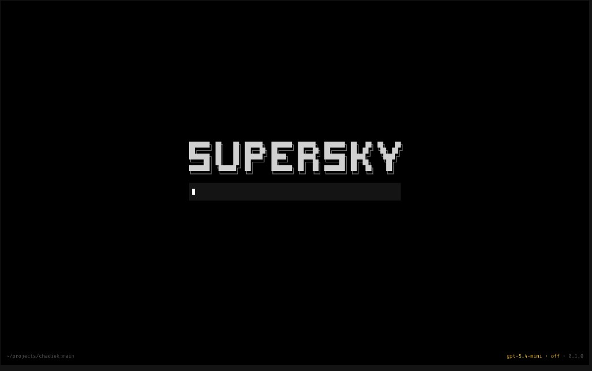

# Supersky

A minimal coding-agent harness in the terminal: a short system prompt, four tools (`read`, `edit`, `write`, `bash`), and a fullscreen [OpenTUI](https://opentui.com) UI. Sessions, slash commands, and keyboard shortcuts wrap the same kind of tight agent core you see in projects like [pi.dev](https://pi.dev).



## Quick start

**Requires [Bun](https://bun.sh).**

```bash
cd tui
bun install
chmod +x bin/supersky
bun link
```

From any project directory, run **`supersky`** to open the UI with that folder as the working tree.

Use **`/login`** in the composer to connect a model provider, then ask for help with your code. Type **`/hotkey`** to see shortcuts, or run **`exit`** and press **Enter** to quit.

## Slash commands

Prefix with `/` in the composer (or open the command menu):

| Command | Description |
|--------|-------------|
| `/login` | Connect a provider |
| `/logout` | Disconnect a provider |
| `/model` | Change model |
| `/sessions` | List and switch sessions |
| `/rename` | Rename current session |
| `/settings` | Configure Supersky |
| `/new` | Start a new session |
| `/fork` | Fork from the last user message |
| `/export` | Export session transcript |
| `/copy` | Copy the last assistant message |
| `/hotkey` | Show hotkeys |
| `/variants` | Change thinking level |
| `/compact` | Compact the active session |
| `/editor` | Open the project in your editor |
| `/exit` | Quit |

## Development

```bash
cd tui
bun run dev      # watch mode
bun run test
bun run check    # lint, typecheck, and test
```

More in [`tui/README.md`](tui/README.md).
